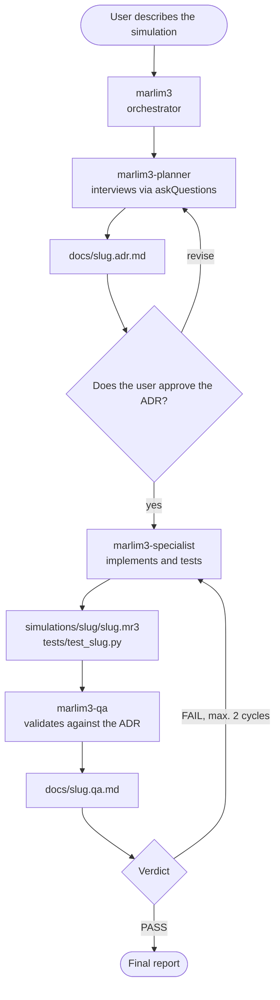
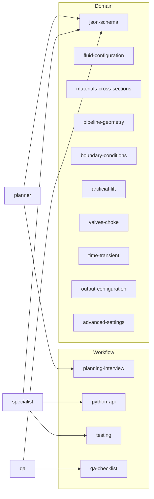

# Marlim3 agents guide

This repository includes a GitHub Copilot agent workflow for building complete Marlim3 simulations: from a natural-language request to a tested and verified `.mr3` file. You describe the simulation, the planner interviews you and records everything in an ADR, the specialist implements it and the QA validates it.

## Workflow overview

## Step by step

1. Invoke the `marlim3` agent (or `marlim3-planner` directly) and describe the simulation you want: system type, fluids, geometry, transient event, etc.
2. The planner asks structured questions in batches (scope, fluids, geometry and thermal, boundary conditions and equipment, events and outputs). Anything you don't answer becomes a default recorded in the ADR.
3. The planner writes the complete plan to `docs/<slug>.adr.md`, with a cross-reference table, deliverables and acceptance criteria. Review and approve it.
4. The specialist reads the ADR and generates `simulations/<slug>/<slug>.mr3` (English keys, with `"language": "en"`), the optional Python script and the `tests/test_<slug>.py` suite, following the repository conventions (`simulacao` marker, executable guard, `tmp_path`). It validates against the schema and runs the tests before delivering.
5. The QA independently checks everything (ADR conformance, schema, cross-references, array consistency, physical plausibility, test execution) and writes the final report to `docs/<slug>.qa.md` with a PASS, PASS WITH WARNINGS or FAIL verdict.
6. On a FAIL, the orchestrator returns the findings to the specialist (at most 2 cycles) and re-runs the QA. At the end, you receive the summary with all paths and results.

## Agents

| Agent | Role | Deliverable |
|--------|-------|---------|
| [marlim3](agents/marlim3.agent.md) | Orchestrates the pipeline and the correction cycle | Final report |
| [marlim3-planner](agents/marlim3-planner.agent.md) | Interviews the user and makes the engineering decisions | `docs/<slug>.adr.md` |
| [marlim3-specialist](agents/marlim3-specialist.agent.md) | Implements the ADR and writes the tests | `simulations/<slug>/`, `tests/test_<slug>.py` |
| [marlim3-qa](agents/marlim3-qa.agent.md) | Verifies and issues the verdict | `docs/<slug>.qa.md` |

## Skills

Each agent loads only the skills relevant to the case. The workflow ones define the process; the domain ones distill the official documentation ([docs/user-guide/](../docs/index.md), [docs/schema_branch.json](../docs/schema_branch.json)) and point to the authoritative files.

| Skill | When it is used |
|-------|----------------|
| [marlim3-planning-interview](skills/marlim3-planning-interview/SKILL.md) | Interview protocol, safe defaults and ADR template |
| [marlim3-python-api](skills/marlim3-python-api/SKILL.md) | `Branch`/`Tramo` API, `simulate()`, results and CLI |
| [marlim3-testing](skills/marlim3-testing/SKILL.md) | Repository pytest conventions and test template |
| [marlim3-qa-checklist](skills/marlim3-qa-checklist/SKILL.md) | Verification checklist and QA report template |
| [marlim3-json-schema](skills/marlim3-json-schema/SKILL.md) | `.mr3` structure, units, EN/PT keys and cross-references (always loaded) |
| [marlim3-fluid-configuration](skills/marlim3-fluid-configuration/SKILL.md) | Black-oil, flash table, compositional, emulsions, PVT |
| [marlim3-materials-cross-sections](skills/marlim3-materials-cross-sections/SKILL.md) | Materials, radial layers, rock formation |
| [marlim3-pipeline-geometry](skills/marlim3-pipeline-geometry/SKILL.md) | Segments, angles or XY mode, discretization, thermal coupling |
| [marlim3-boundary-conditions](skills/marlim3-boundary-conditions/SKILL.md) | IPR, sources, separator, gasInj, injector well |
| [marlim3-artificial-lift](skills/marlim3-artificial-lift/SKILL.md) | Gas lift, BCS/ESP, pumps, annulus unloading |
| [marlim3-valves-choke](skills/marlim3-valves-choke/SKILL.md) | Valves, chokes, PIG, leaks, shutdown and restart |
| [marlim3-time-transient](skills/marlim3-time-transient/SKILL.md) | Transient mode, initial condition, step schedule, snapshots |
| [marlim3-output-configuration](skills/marlim3-output-configuration/SKILL.md) | Profiles, trends, radial outputs and result DataFrames |
| [marlim3-advanced-settings](skills/marlim3-advanced-settings/SKILL.md) | Numerical tuning, performance, paraffin, 3D diffusion |

## Tips

- To only plan (without implementing), call `marlim3-planner` directly. To implement an already approved ADR, call `marlim3-specialist` passing the ADR path. To audit an existing case, call `marlim3-qa`.
- Tests with the `simulacao` marker require the compiled executable and are skipped automatically without it (see [tests/README.md](../tests/README.md)). A skipped test is not a passing test.
- Run a finished case with `uv run pytest tests/test_<slug>.py -v` or via `marlim3.Branch().from_json(...)`.
