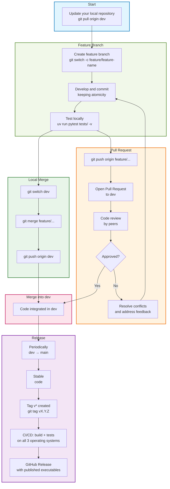
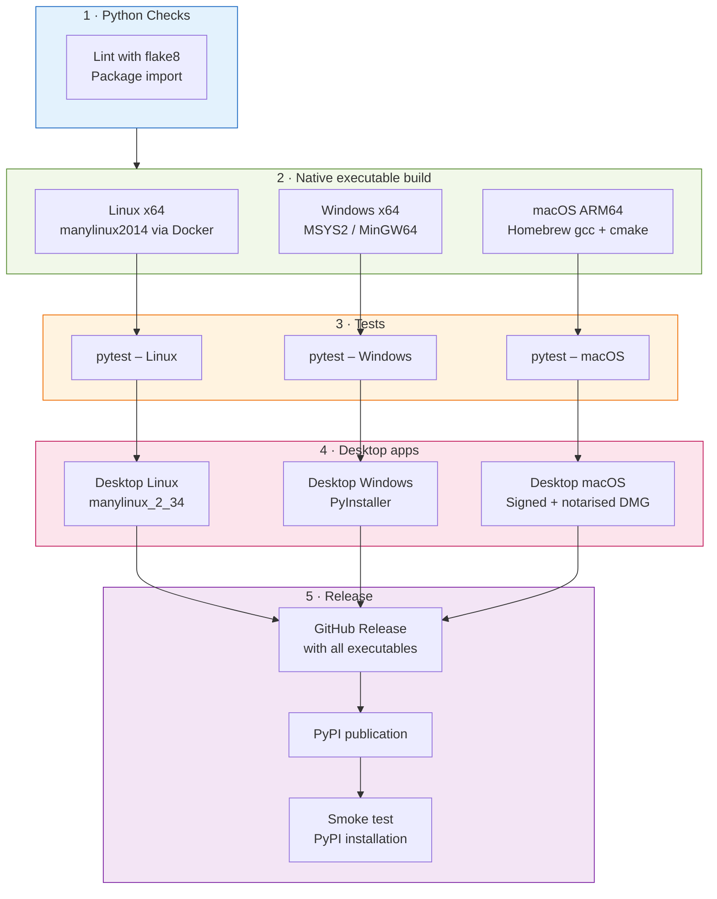

[![Apache 2.0][apache-shield]][apache] 

[apache]: https://opensource.org/licenses/Apache-2.0
[apache-shield]: https://img.shields.io/badge/License-Apache_2.0-blue.svg

Thank you for your interest in contributing to the Marlim3 project!

We expect to receive various types of contributions from individuals, research institutions, startups and companies.

In this guide we present how the expected contributions might be proposed.

## Getting started

The recommended first step is to read the project's [README](https://github.com/petrobras/marlim3/blob/main/README.md) for an overview of what this repository contains.

## Asking questions

Please do not open issues to ask questions. Please use the Discussions section accessed through the link that appears in the top menu.

## Before contributing

Before you can contribute to this project, we require you read and agree to the following documents:

* [CODE OF CONDUCT](https://github.com/petrobras/marlim3/blob/main/CODE_OF_CONDUCT.md);
* [CONTRIBUTOR LICENSE AGREEMENT](https://github.com/petrobras/marlim3/blob/main/CONTRIBUTOR_LICENSE_AGREEMENT.md);
* This contributing guide.

It is also very important to know, participate and follow the discussions. Click on the Discussions link that appears in the top menu.

---

## Current scope of contributions

Marlim3 is undergoing a **major architectural refactoring**, and that changes
what is useful to contribute right now.

**Most welcome at the moment:**

| Contribution | Why it helps |
|---|---|
| Reference cases for the regression suite | The refactored engine has to reproduce known-correct results |
| Validation cases for limiting conditions | Analytical or experimental references catch errors regression cannot |
| Bug reports with a reproducible input file | They define what the new architecture must get right |
| Issues labelled [`help wanted`](https://github.com/petrobras/marlim3/issues?q=is%3Aissue+is%3Aopen+label%3A%22help+wanted%22) | Scoped so they do not collide with the refactoring |
| Documentation fixes | Independent of the engine internals |

**Deferred for now:** large changes to the engine architecture, and fixes to
code the refactoring will replace. A bug report may be accepted and the fix
still deferred — that is not a rejection of the report.

If you are unsure whether something fits, open a Discussion before investing
time in a pull request. Broader contributions will be accepted once the
refactoring settles.

## Ways to contribute

| Contribution | Where to start |
|---|---|
| Report a bug | [Bug report template](.github/ISSUE_TEMPLATE/bug_report.md) |
| Propose a feature | [Feature request template](.github/ISSUE_TEMPLATE/feature_request.md) |
| Improve documentation | [`docs/`](docs) — built with MkDocs |
| Add or fix a model | [`demos/`](demos) and the [model reference](docs/single-branch-model-reference/index.md) |
| Change the simulation engine | [`src/`](src) — C++ and Fortran |
| Change the Python package | [`marlim3/`](marlim3/README.md) |

A good bug report includes the input file, the command or script used, the
`simulacao.log` produced, and what you expected instead. Input files are usually
small enough to paste or attach directly.

## Setting up

See [Getting Started](docs/getting-started.md) for installation, and
[Building from source](docs/getting-started.md#building-from-source) for the
C++/Fortran toolchain.

The short version, for a development clone:

```bash
uv sync --locked --group dev
cmake --preset gcc-release              # or mingw-release on Windows
cmake --build --preset gcc-release -j
MARLIM3_SKIP_BUILD=1 uv sync --locked
```

## Repository layout

| Path | Contents |
|---|---|
| `src/core/` | C++ simulation engine |
| `src/fortran/` | Fortran thermodynamics and flash routines |
| `src/include/` | headers, including generated ones |
| `marlim3/` | Python package — [guide](marlim3/README.md) |
| `marlim3_desktop/` | desktop application — [guide](marlim3_desktop/README.md) |
| `gui/` | Streamlit interface |
| `regression_tool/` | regression and coverage tooling — [guide](regression_tool/README.md) |
| `tests/` | test suite — [guide](tests/README.md) |
| `demos/` | example models, PT under `demos/pt-br/` |
| `docs/` | MkDocs documentation source |

## Making changes

### Style

The repository ships an [`.editorconfig`](.editorconfig) — use an editor that
honours it. In short: UTF-8, LF line endings, 4-space indentation, no trailing
whitespace, final newline. Python lines up to 127 characters
([`.flake8`](.flake8)).

Portuguese identifiers are widespread in the engine and are being translated
gradually. When you touch existing code, keep the surrounding naming consistent
rather than mixing styles within a file. New user-facing text should be in
English.

### Input keys

The JSON parser is **case-sensitive and does not warn about unrecognised keys**.
A key the parser does not know is silently ignored and the corresponding setting
keeps its default, so a typo produces a plausible-looking result for the wrong
model.

If you add or rename an input key, all of these have to agree:

1. `src/core/JSON_entrada.cpp` — the string literal the parser registers;
2. `src/core/Leitura.cpp` — where the value is read into the data structures;
3. `src/core/validaTipoJson.cpp` — type and business-rule validation;
4. `docs/schemas/branch.pt.json` and `branch.en.json` — the published schema;
5. `marlim3/translations.json` — the PT ↔ EN map, shared with the C++ translator;
6. any demo that uses the key.

Renaming a key is a breaking change. Add the old spelling to the discontinued
list in `validaTipoJson.cpp` so users get an explicit error naming the
replacement, and document it in
[`docs/single-branch-model-reference/migration.md`](docs/single-branch-model-reference/migration.md).

### Tests

Run the suite before opening a pull request:

```bash
uv run pytest tests/ -v
```

Two markers separate tests that need the compiled engine:

```bash
uv run pytest tests/ -m "not simulacao"   # unit tests only
uv run pytest tests/ -m regressao         # regression against stored references
```

See [tests/README.md](tests/README.md) for details, including how reference
files are generated and updated.

Optional C++ unit tests, for changes to the numerical core:

```bash
cmake -S . -B build -DMARLIM_BUILD_TESTS=ON
cmake --build build --target test_friction_factor
ctest --test-dir build --output-on-failure
```

### What to add alongside a change

| Change | Expected with it |
|---|---|
| Bug fix in the engine | a test that fails before the fix |
| New or changed input key | schema, translations, migration note (see above) |
| New correlation or numerical method | a unit test against the published reference, and the citation in the code |
| New demo | an entry in `tests/test_demos_steady_state.py` |
| Behaviour change in results | note in the pull request whether regression references need regenerating |

The regression suite compares results against previously stored references. It
detects *change*, not *correctness* — a reference generated from wrong output
will happily keep passing. For anything touching physics or numerics, a check
against an external reference (a published correlation, an analytical solution,
experimental data) is worth much more than a regression reference.

## Pull requests

Base your branch on `main` and keep pull requests focused on one concern.

**Commit messages** — the repository uses plain imperative subject lines
(`Align parser input keys with the documented schema`), no mandatory prefix. Use
the body to explain *why*, not just *what*; the reasoning is what reviewers and
future readers need.

**Before opening:**

- [ ] tests pass locally
- [ ] `uv run flake8 .` reports no new issues
- [ ] documentation updated if behaviour or input format changed
- [ ] the pull request describes what was verified, and how

CI runs build and test jobs on Linux, Windows and macOS. Draft pull requests
also trigger it, which is a convenient way to get a cross-platform build of your
branch.

**Review.** Explain in the description how you convinced yourself the change is
correct. For numerical changes, that means comparing against something
independent of the code being changed — not only that the existing suite stayed
green.

## Reporting a security issue

Do not open a public issue for a security vulnerability. Use GitHub's private
vulnerability reporting, or contact the maintainers directly.

## Git Workflow

### Basic concepts

Git tracks changes to files through commits. Each commit is a snapshot of the project at a given moment, associated with a message describing what was done.

Essential day-to-day commands:

```bash
git status                        # shows the current state of the repository
git diff                          # shows changes not yet staged
git add file.py                   # adds a file to staging
git add .                         # adds the entire directory to staging
git commit -m "message"           # creates a commit with the staged files
git push                          # sends commits to the remote repository
git pull                          # downloads and integrates commits from remote
git log --oneline                 # summarised commit history
git switch branch-name            # switches branch
git switch -c branch-name         # creates and switches to a new branch
```

### Branches: `main` and `dev`

The project uses two permanent branches:

- `main`: contains only stable, tested code. **Never commit directly to it**.
- `dev`: continuous integration branch. All development is merged here before going to `main`.

### Workflow Diagram




### Step-by-step workflow

1. **Update your local repository**: `git pull origin dev`
2. **Create a feature branch**: `git switch -c feature/feature-name`
3. **Develop and commit** on your branch (keeping atomicity)
4. **Test locally**: `uv run pytest tests/ -v`
5. **When ready, push**: `git push origin feature/...`
6. **Integrate into `dev`** via one of two paths:
   - **Via Pull Request** *(recommended for larger changes or those requiring review)*:
     1. Open a Pull Request from `feature/...` to `dev`
     2. Wait for review and approval from peers
     3. After approval, the branch is merged into `dev`
   - **Via local merge** *(for smaller, already validated changes)*:
     1. `git switch dev`
     2. `git merge feature/feature-name`
     3. `git push origin dev`
7. **Periodically**, `dev` is merged into `main` after validation

### Note on forks

Ideally, feature branches would be created in personal fork repositories, merged into dev, and then pull requests opened to the Petrobras repository. However, this is only possible on personal computers, since Petrobras has blocked pushes to personal repositories. Therefore, on work computers, changes are made directly in the official repository.

### Resolving conflicts

Conflicts occur when two people modify the same lines of a file. Git marks these conflicts and requires manual resolution.

**Detecting conflicts**:
- `git status` will show conflicted files as "both modified"
- `git diff` will show conflicts marked with `<<<<<<<`, `=======`, `>>>>>>>`

**Resolving conflicts**:
1. Open the conflicted file in the editor
2. Look for the conflict markers
3. Edit manually to resolve
4. Remove the conflict markers
5. `git add resolved-file.py`
6. `git commit` (no additional message needed)

**Tips for avoiding conflicts**:
- Sync frequently with `dev`: `git pull origin dev`
- Break large tasks into smaller ones
- Communicate with the team about areas of code under development
- Keep feature branches short-lived

### Commit atomicity

Each commit should represent a single, cohesive logical change. Avoid commits that mix refactoring, bug fixes, and new features. Atomic commits make it easier to review, track issues, and revert specific changes with `git revert`.

**Bad**:
```
fix: fix bug X and add feature Y and refactor module Z
```

**Good**:
```
fix: fix division by zero in pressure calculation
feat: add support for radial temperature profiles
refactor: extract interpolation logic into its own module
```

### Semantic commit messages

We adopt the [Conventional Commits](https://www.conventionalcommits.org/) standard.

**Structure**:
```
<type>(<optional scope>): <short imperative description>
```

**Common types**:

| Type       | When to use                                                    |
|------------|----------------------------------------------------------------|
| `feat`     | new feature                                                    |
| `fix`      | bug fix                                                        |
| `docs`     | documentation-only changes                                     |
| `refactor` | code change that neither adds a feature nor fixes a bug        |
| `test`     | adding or fixing tests                                         |
| `chore`    | maintenance tasks (CI, dependencies, etc.)                     |
| `perf`     | performance improvement                                        |

**Examples**:
```
feat(solver): add new correlation for pressure gradient
fix(python): fix serialization of profiles with null values
docs: update installation guide with conda requirements
test(motor): add test case for satellite well with gas lift
```

### Pull Requests

All code incorporated into Marlim3 must arrive via a Pull Request to the `dev` branch. The PR is the moment for collaborative review.

**Before opening a PR**:
- Make sure tests pass locally (`uv run pytest tests/ -v`)
- Resolve conflicts with the target branch
- Write a clear description of what the PR does and why

**PR best practices**:
- Keep PRs small and focused (ideally fewer than 400 lines)
- Use a descriptive title following the semantic commit standard
- Reference related issues (e.g. "Closes #123")

### Code Review

Code review is an essential practice for maintaining project quality. The goal is to identify bugs, improve clarity, share knowledge, and ensure conformance with standards.

### Issues and Projects

Project planning is done through issues, organised in a Kanban board in the Projects area of the public repository. This provides visibility into planning and facilitates external contributions.

**Issue types**:
- `bug`: something is not working as expected
- `enhancement`: improvement to existing functionality
- `feature`: new functionality
- `documentation`: improvement or addition of documentation

## CI/CD Pipeline (GitHub Actions)

The `.github/workflows/build-test-release.yml` file defines the **Build, Test & Release** pipeline for `Marlim3`. It is triggered in three situations:

| Trigger | What it runs |
|---|---|
| Pull Request to `develop` or `main` | Python checks + build + tests |
| Push to `develop` | Python checks + build + tests |
| Push of tag `v*` | Everything above + desktop app builds + GitHub release + PyPI publication |

### Pipeline stages




### Details of each stage

**1. Python checks** — runs on Ubuntu and checks for syntax errors/undefined names with `flake8` and validates the package import.

**2. Native executable build** — compiles the C/Fortran engine in parallel for Linux (inside a `manylinux2014` container for maximum compatibility), Windows (MSYS2/MinGW64), and macOS ARM64 (Homebrew). Each platform produces an artifact with the executable and its SHA-256.

**3. Tests** — each test job downloads the artifact compiled by the previous stage (from the same pipeline run), validates the SHA-256, installs the executable in the Python package, and runs `pytest tests/ -v`. This ensures tests always use the freshly compiled binary.

**4. Desktop apps** *(only on `v*` tags)* — builds the desktop applications with PyInstaller/PySide6 for each platform. On macOS, the app is signed with an Apple Developer ID certificate and notarised by Apple before being packaged into a `.dmg`.

**5. Release** *(only on `v*` tags)* — after all tests and desktop builds pass, automatically creates a **GitHub Release** with the following executables attached:

| File | Platform |
|---|---|
| `Marlim3-linux-x64` | Engine — Linux x64 |
| `Marlim3-windows-x64.exe` | Engine — Windows x64 |
| `Marlim3-macos-arm64` | Engine — macOS ARM64 |
| `Marlim3-desktop-linux-x64` | Desktop app — Linux x64 |
| `Marlim3-desktop-windows-x64.exe` | Desktop app — Windows x64 |
| `Marlim3-desktop-macos-arm64.dmg` | Desktop app — macOS ARM64 (DMG) |

Each executable comes with a `.sha256` file for integrity verification. The Python package is then published to **PyPI** and a smoke test verifies the installation on clean runners.

### Optimisation: skip duplicates

The pipeline uses [`skip-duplicate-actions`](https://github.com/step-security/skip-duplicate-actions) to avoid re-running a workflow when a push to `develop` has identical content to a PR that already passed successfully. Tag pushes are never skipped.